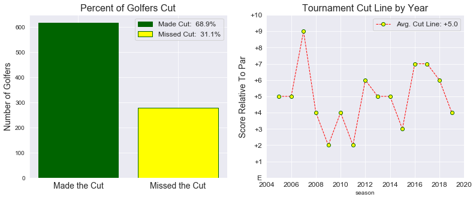
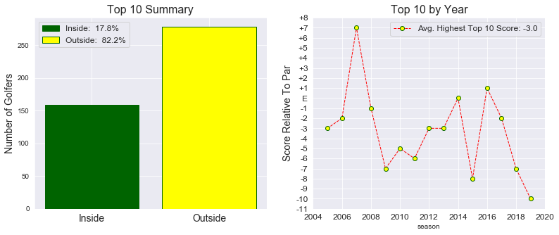
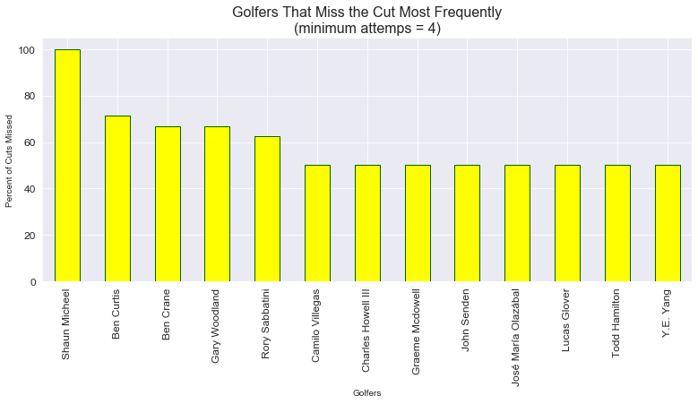
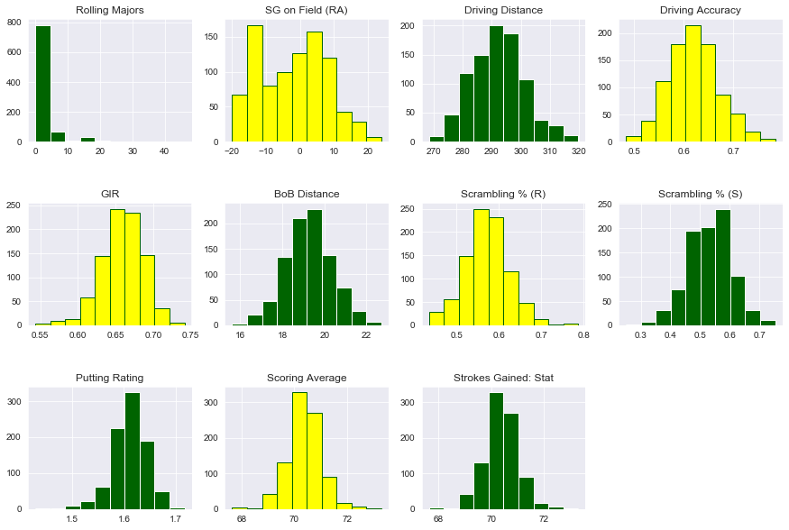
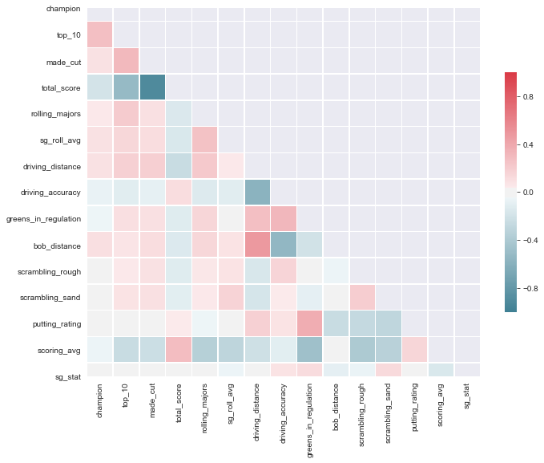
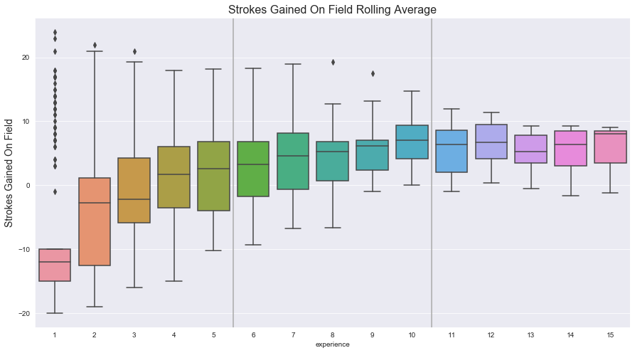

## Predicting the 2020 Masters Tournament Using Machine Learning
By J.P. Rinfret

## Overview
With this project, my goal was to predict the outcome of the 2020 Masters Tournament. I used classification to first predict which golfers would make the cut and then regression to predict their final scores--cuting it off at the lowest 10 scores in order to predict the top 10 of the tournament. Finally, I compared the predicted top 10 subset to the actual top 10 each year going back to 2013 (I arbitrarily cut it off around 500 data points).

The idea here was that, if I can capture each year's champion in this set of 10 golfers each year, you can create a venture capital like risk/return profile by betting equal money and all ten golfers. Because of the large multiples offered on an individual golfer to win, (e.g., when Tiger Woods won in 2019, Vegas odds were +1200 for him winning, which means a $100 bet yields $1,200 of winnings) you can bet on multiple golfers to win to increase your chances of being in the money at the end of the tournament. Let's take a look at 2020 betting odds, which are listed on slide 12 of my executive overview (link below), and assume we bet $10 on each golfer to win the Masters ($100 total risk). You have 3 possible scenarios that could unfold: (1) The champion is not one of the predicted golfers, and you lose your entire bet; (2) Brooks Koepka wins, and you break even because you lose $90 on the other golfers but win $90 thanks to Brooks; or (3) one of the other 9 golfers in the predicted set wins and you are in the money.

Let's make a few other assumptions/generalizations and anaylze this further. The model has correctly contained the champion in the predicted subset 5 of the last 7 tournaments. To be conservative, let's say that the model is expected to predict a subset containing the champion 50% of the time (much lower than using its current 7 year streak). If we assign two general outcomes: (A) the champion is in the subset and (B) the champion is not in the subset, we can assign each scenario a 50% probability of occuring (using our conservative estimate). If we break down scenario A further, we can assign a 10% winning probability to each golfer in the subset (I would not say this is true given how sports work but let's oversimplify for the sake of this analysis). Using the betting odds on slide 12, we can easily calculate our expected payout on a $100 bet as follows:

Total Risk: $100

Expected Payout of Scenario B: 50% x $0 = $0

Expected Payout of Scenario A: 50% x ((10% x $180) + (10% x $200) + (10% x $100) + (10% x  $90) + (10% x $140) + (10% x $400) + (10% x $180) + (10% x $400) + (10% x $200) + (10% x $500)) = $120

Total Expected Payout: $120, or a 20% return

[Executive Overview](https://docs.google.com/presentation/d/1nH3akRXU6ILs_raoP0fZK6bcODCH0-iZTfAy8SXOVi8/edit?usp=sharing)

## Data
For this project I used full season aggregate stastics from previous seasons to predict the following years outcomes (i.e., I used data up until 12/31/18 to predict the outcome of the 2019 Masters). I considered popular golf stats like driving ditance, accuracy, greens in regulation percentage, scrambling percentage, putting rating, and scoring average. Additionally, I enginereed three additional features, summarized below, to capture the inherent interactions between golf stats (e.g., the further you hit the ball off the tee the closer your second shot), which improved my results. My eleventh and final feature was a rolling average of a golfers previous tournament results compared against the field's average score. I used PCA to confirm that all 11 features were important to my results. 

Summary of workflow and packages used can be found in the appendix of the Executive Overview

## Feature Engineering
1. "Rolling Majors": I wanted to capture a golfer's ability to perform well in major golf tournaments (e.g., Tiger Woods historically and Brooks Koepka more recently). To do this, I created a weighted feature the looked back at the results of the 4 major tournaments over a rolling 5, 3, and 1 year window. I then weighted 1 year results the most, 3 years second most, and 5 years the least. 

2. "Birdie or Better Distance": I wanted to capture a distance from the hole where you can be confident a golfer will make birdie or better from given his approach shot found the green. To do this, I used a published statistic referred to as "proximity," which represents a golfers average distance from the hole given that his approach shot found the green. I created a circle I called Proximity Distance Area using proximity as the radius. I then decreased the area of this circle by multiplying it by a golfers putting conversation percentage (a stat representing how many putts a golfer makes when putting for birdie or better) and then solved for the radius of this reduced circle.

3. "SG Stat": The PGA Tour publishes many relative to other golfers statistic for each golfer for each part of the gain. However, I realized these stats for an individual golfer are very correlated to eachother (e.g., the further you hit the ball, the closer to the hole you are after your appraoch shot, the more putts you make). Therefore, I wanted to capture the relationship between these various features in one feature. I then used the sign of the SG: Total stat to determine the sign of this engineered feature

## Exploratory Data Analysis
Cut Summary (Classification) |Top 10 Summary (Regression)
:--:|:--:
|

Champion Score Summary |Worst Performers (min. 4 attempts)
:--:|:--:
|

Feature Distributions|Feature Correlations
:--:|:--:
 |

Does Experience Matter? |
:--:|
 |

## Results
My best classification model was a Random Forest Classifier with a F1-Score of 76%. Given the betting nature of this project, I focused on reducing capital losses (type I errors) and opporunity cost (type II errors)--hence F1. I also ran Logistic Regression, AdaBoost and Gradient Boosting Classifiers, however these had lower F1 scores (a summary of all metrics can be found in the executive over). I handled the class imbalance of the training set (2/3 make the cut, 1/3 miss the cut) using SMOTE and use StandardScaler to scale the data. 

My regression models (Ridge, Lasso, unpenalized Linear Regression, and Random Forest Regression) all had similar RMSEs around 5 strokes, however Random Forest Regression had the best back test results. 

The prediction portfolio (again, equal money is bet on each prediction each year) has an IRR of approximately 150% (using excel's IRR function, I had cash outflows of $10/year occuring in March and either the winnings or $0 in losing years occuring in April of each year). 
